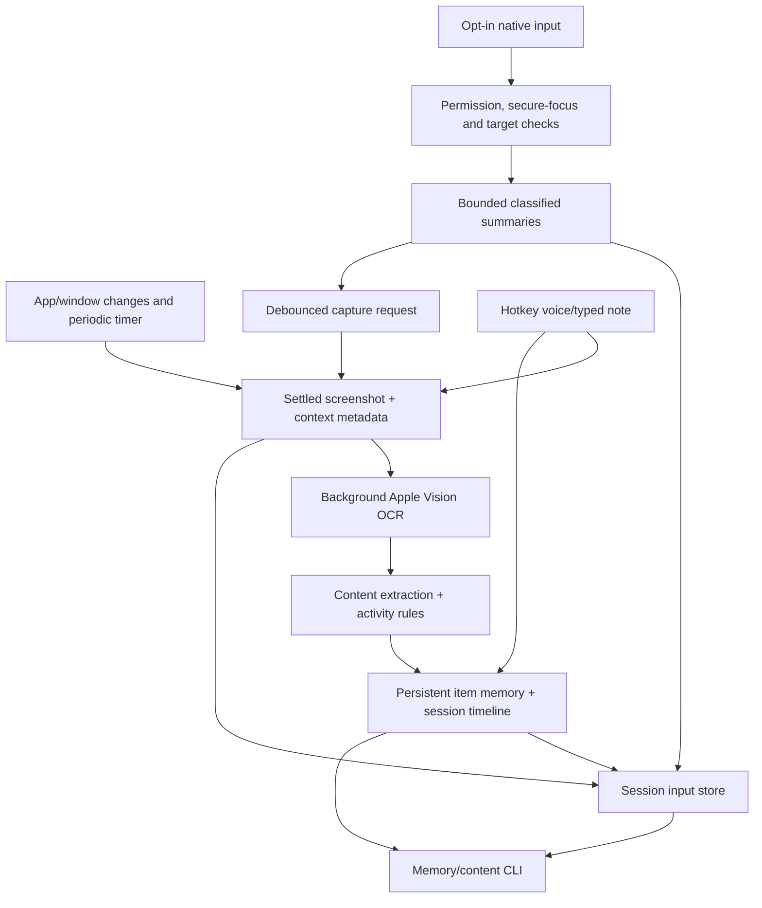

# LMemM technical handover for Aditya

**Date:** 5 October 2026  
**Feature branch:** [`feat/input-timeline`](https://github.com/adityakhuntia/LMemM/tree/feat/input-timeline)  
**Latest implementation commit:** `f148813`  
**Automated verification:** 89 tests passed in the final full macOS run  
**Integration state:** implementation pushed to the feature branch; not merged into `main`. This document summarizes the work through that commit.

## 1. Where the product stands

LMemM now has a local observation-and-memory foundation: screen capture, on-device OCR, heuristic activity interpretation, persistent items across sessions, bounded source excerpts, explicit user notes, and an opt-in keyboard/cursor evidence timeline.

The next product goal is project continuity: opening a project and asking, “What did we do here two days ago, why, and what is left?” We have not built that recall experience yet. Today's CLI exposes evidence; it does not infer reliable intent, task completion or a complete story of the user's work.

The largest progress this session was moving beyond titles/activity labels into retained content and timestamped interaction evidence, while preserving your activity and dictation work.

## 2. The two upstream commits integrated from your work

| Commit | Contribution | How it fits the current implementation |
| --- | --- | --- |
| [`3ec423e`](https://github.com/adityakhuntia/LMemM/commit/3ec423e4b2015612e80843ccfd9b3ffb5db681d1) — **Activity tracking from screen changes, one rule for same-vs-new things** | Added `activity.py`: pixel differences, changed regions and scrolling, combined with input-recency counters and sampled pointer position. Added typing/reading/receiving/focus categories, per-activity seconds/text and `mostly`. Pixel-identical screens skip OCR. Identity rules use observed authored-content continuity to distinguish items sharing a location. | Retained as the activity layer. We repaired authoritative Google Docs identity so content disappearance cannot split the same known document across sessions. Activity labels remain heuristic; the new input timeline is separate evidence rather than a wholesale rewrite of this classifier. |
| [`df94289`](https://github.com/adityakhuntia/LMemM/commit/df94289fa00eab1f0f67d43f9c0e94ac0b392234) — **Hotkey dictation onto the current memory entry, neater memory.json and output** | Added Control–Option–N, editable native note panel, Apple Speech helper, and foreground note attachment. Split readable `memory.json` from internal `.index.json`; improved CLI/session output and added OCR retries. | Integrated while preserving our content/identity/OCR fixes. Added mandatory local speech recognition, transcript cleanup, verified note ownership, nonblocking pending-note persistence, and explicit schema compatibility/error handling. |

These upstream commits are the base of the feature branch, not replaced implementations. The initial prototype commit predates this work. No commit comments were returned during the dictation commit review.

## 3. Work added during this session

### Capture and OCR reliability

- Repaired Apple Vision/PyObjC integration using official framework bindings, native `NSDictionary` request options and explicit success/error tuple handling.
- Preserved accurate/automatic-language/fast OCR retry behavior from the upstream work.
- Added generated-image tests that exercise real on-device OCR, rather than requiring personal screenshots.
- Added foreground-window geometry to capture metadata so retained content can filter out text outside the selected window region.

This filtering improves excerpts, but does not crop the saved screenshot or fully isolate activity analysis. Foreground-window selection still needs repair, especially Safari toolbar-sized window selection.

### Meaningful content retention

New `memory_content.py` retains deduplicated OCR excerpts with source attribution and first/last observation times. The current bound is **12 excerpts per item, up to 3,000 characters per extracted excerpt**. `memory --content` exposes recent previews.

Explicit phrases such as “Decision:” or “We chose…” are retained as **unverified source quotes**. They might belong to a collaborator or an AI response. They are not verified user decisions, inferred reasoning, or task commitments.

### Stable cross-session document identity

Real Google Docs document URL IDs are authoritative, including `/document/u/0/d/<id>` routes. Returning in another session, scrolling away from previous text, or renaming a document reuses its existing memory item. Distinct document IDs stay separate even if titles/content match.

Generic title-based references, drafts, chats and code files still rely on weaker rules. Existing historical duplicates were not bulk-merged. Browser Automation/URL access is necessary for the authoritative path.

### Dictation, note ownership and storage safeguards

- Speech is required to run on-device; unsupported/denied recognition falls back to typed notes, without server recognition. The helper does not save audio.
- Close/cancel/lock/sleep/shutdown clean temporary transcripts and cancel the helper; pending permission waits also support cancellation.
- A note requires a fresh captured context and post-capture checks, including browser context. It cannot silently attach to the previously visited item.
- OCR runs outside the memory lock. Notes awaiting OCR persist immediately and attach to the exact resolved frame; failures remain explicitly unresolved.
- Schema version 2 preserves full internal evidence and readable exports. Invalid/readable-only stores without a usable index fail visibly instead of silently becoming empty memory.

### Opt-in keyboard and cursor timeline

New `input_events.py`, `input_monitor.py` and `input_store.py` provide:

- Listen-only native event collection, explicitly enabled for **VS Code only**.
- Keyboard burst counts/times, coarse 3×3 cursor movement and drag regions, click categories and scroll direction/magnitude buckets.
- Monotonic event offsets, UTC times, sequence/event IDs and permitted-context IDs.
- Capture references with explicit before-image age; memory-item links after OCR resolves the capture.
- Debounced capture requests for completed keyboard/scroll bursts, clicks and recognized navigation. Pointer movement alone does not trigger captures; periodic capture remains.
- Visible permission/focus/listener gaps; pause/resume/status controls that also stop screenshot capture and cancel notes when paused.
- Input context bounded to 30 seconds in RAM; detailed input/source copies retained for at most 24 hours, configurable shorter, with a 4,096-event disk cap and loss counters.

Ordinary keyboard activity does not extract characters. The later, explicitly requested navigation classifier transiently checks modifiers and Tab identity for **Ctrl+Tab / Cmd+Tab and Shift reverse variants**. It stores only action, direction and accepted step count—never a raw key/modifier journal. Clipboard and editable accessibility values are not read.

### Native VS Code focus repair and navigation cleanup

The first permission-enabled live run started the listener but retained no input. Native diagnosis found that VS Code's Electron accessibility tree was disabled even though macOS permission was granted.

The collector now requests `AXManualAccessibility` for foreground, explicitly allowed VS Code, on the main loop. It restores flags it changed on normal shutdown. The native probe verified that this exposes the focused element; no text values were read. Ordinary non-text-field editor roles can report “no subrole value”; this is handled, while unverified text fields remain blocked. **Test in an editor file, not the integrated terminal.**

A subsequent live run recorded input successfully. It also exposed false `out_of_order` gaps: polling/gap timestamps were advancing the clock used to compare native events. Native-event ordering is now separate from gap/display time. Truly delayed events still fail closed at 100 ms; that guard was not relaxed to inflate coverage.

Shortcut steps can link to an observed allowed-context change or departure within two seconds. Review caught links that could be overwritten or cross a pause; confirmation consumption and gap fencing were added. A linked change is evidence observed after a shortcut, not proof of causation or selection.

### Retention, provenance and safe deletion

Session contributions record source-owned notes/excerpts, observed metadata and numeric activity deltas. An immutable baseline preserves pre-feature evidence. Integrity checks use hashes rather than duplicate full private snapshots.

Session deletion reconstructs shared memory from the baseline plus surviving contributions and removes owned session/input/capture evidence. An operation manifest makes interrupted deletion recoverable before memory is loaded.

Deletion blocks active tracking, missing legacy provenance, replay references, external memory changes, and screenshots still needed by retained evidence. Reviews/tests corrected duplicated deleted content, inherited metadata, repeated deletion, interrupted recovery, shared screenshot loss and all-session pruning. Closed stores reject late OCR writes.

## 4. Architecture and persistence



| Component | Responsibility |
| --- | --- |
| `tracker.py` | Main-loop capture scheduling, context/lifecycle checks, background OCR queue, item identity, timeline, notes and input/capture integration. |
| `resolver.py`, `understand.py`, `activity.py` | Vision OCR/layout, activity descriptions, pixel/text-change heuristics. |
| `memory_content.py` | Foreground excerpt extraction, bounded history and unverified decision quotes. |
| `dictation.py`, `listen/` | Native note UI/hotkey and local speech helper. |
| `input_monitor.py` | Listen-only tap, native timing, permissions, secure-focus/owner/target checks, VS Code AX support and narrow shortcut classification. No OCR/file writes in callbacks. |
| `input_events.py` | Pure aggregation, event ordering, context boundaries and bounded transient state. |
| `input_store.py` | Private input files, capture links, corpus pruning, contribution records and reconstructive deletion/recovery. |
| `lmemm.py` | Start options, memory/content/events inspection, control commands and deletion preview/confirmation. |

The main loop handles native events, controls and capture scheduling; the worker handles OCR. Memory mutations share a lock, while OCR stays outside it. Persistence is local JSON with atomic replacements; it is not yet a transactional multi-client database.

| Path | Contents / retention |
| --- | --- |
| `data/memory/.index.json` | Full internal item state, content, notes and bookkeeping; required for continuation. |
| `data/memory/memory.json` | Readable derived `things` export. |
| `data/memory/sessions/<session>.json` | Item visits, numeric/readable activity durations and notes. |
| `data/<timestamp>.jpg` and `.json` | Ordinary retained screenshots and capture/OCR metadata; older item screenshots can be replaced. |
| `data/memory/inputs/<session>.json` | Bounded detailed summaries, status/gaps, counters and capture/item links. |
| `data/memory/inputs/frames/<session>/` | Retained input source images, governed by input retention. |
| `data/memory/contributions/` | Legacy baseline and session-owned evidence needed for reconstruction; longer-lived than detailed input. |

Pruning runs at startup, periodically while running and on inactive event inspection. When the process is stopped, expiry is enforced on the next startup/read, not by a separate background scheduler. The 24-hour input policy does **not** erase all ordinary memories, notes, excerpts or provenance.

## 5. Verification: what is actually proven

**Latest suite:** 89 tests passed, including real native Vision OCR, compiled local-only speech policy, content/identity/migration, note ownership, fake native event/AX checks, CLI, ordering, retention, navigation correlation and repeated/interrupted deletion. Compile and whitespace checks also passed.

Automated event tests do not install a real listener or microphone. Native typed-note panel save/cancel smoke testing passed; live dictation accuracy and the full daily-use permission/hotkey experience still need validation.

| User-driven live run | Result |
| --- | --- |
| Before input permissions | Ordinary capture worked; input collector unavailable, 70 generic gaps and no detailed input. |
| Permissions granted, before Electron AX repair | 128 seconds of VS Code activity; 14 timeline entries/9 items, but no detailed input despite listener startup. |
| After AX repair | **6 keyboard bursts / 56 accepted presses, 4 movement summaries, 3 clicks, 3 scroll summaries. 11 interaction summaries linked to captures/items; 8 had before-images.** 26 gaps remained, including 10 false ordering gaps subsequently repaired. |

**Still pending:** live verification of the latest ordering and shortcut cleanup (`f148813`), real two-session Google Docs identity acceptance, longer sessions/multiple displays, and live speech accuracy. Basic live input/capture linkage is proven; complete navigation coverage is not.

## 6. How to test on your Mac

### Get the correct branch and dependencies

From your repository checkout, with your own working changes preserved:

```bash
git fetch origin
# First checkout if the local branch does not exist:
git switch --track origin/feat/input-timeline
# If it already exists, use: git switch feat/input-timeline
# Then: git pull --ff-only

python3 -m venv .venv  # skip if your environment already exists
.venv/bin/python -m pip install -r requirements.txt
.venv/bin/python -m unittest discover -s tests -v
```

macOS is required. Requirements now include Cocoa, Quartz, ApplicationServices and Vision PyObjC frameworks, NumPy and Pillow. Building the speech helper requires clang/Xcode Command Line Tools. Run native OCR tests with access to macOS graphics services; a restricted sandbox can prevent them from running.

### Grant permissions to the launching app

In **System Settings → Privacy & Security**, enable the app launching Python—VS Code for its integrated terminal, or Terminal/iTerm otherwise:

- **Screen Recording** for screenshots/window context.
- **Input Monitoring** and **Accessibility** for the opt-in input collector.
- Browser **Automation** when prompted for URLs.
- For voice testing only, allow **Microphone** and **Speech Recognition** for the helper when prompted.

Fully quit/reopen the launching app after permission changes. Do not run two trackers concurrently: they share PID, control and memory files.

### Short input/navigation acceptance test

Start in a foreground terminal:

```bash
.venv/bin/python lmemm.py --input-events --input-app com.microsoft.VSCode
# Optional: --input-retention-hours 4
```

In a second terminal:

```bash
.venv/bin/python lmemm.py status
```

“Recording” means the native listener started; it does not prove accepted events are flowing. Focus a **VS Code editor file** and confirm actual events afterward.

1. Open two or three non-sensitive test files. Type a short sentence, pause for a second, scroll and move/click in the editor.
2. Press Ctrl+Tab a known number of times, then Ctrl+Shift+Tab. Record your actual actions for comparison; VS Code bindings determine selection behavior.
3. From an editor, press Cmd+Tab, return, then try holding Cmd and pressing Tab repeatedly. Also try Cmd+Shift+Tab. These are app-switcher steps, not a window-distance measurement.
4. Switch to an excluded app and return. Its detailed keyboard/cursor input should not be retained. **Ordinary screenshots are not restricted by the input allowlist.**
5. Request pause, check acknowledgement, type/move while paused, then resume:

   ```bash
   .venv/bin/python lmemm.py pause
   .venv/bin/python lmemm.py status
   .venv/bin/python lmemm.py resume
   ```

6. Open/cancel the note panel with Control–Option–N. Confirm it does not become an input/capture source while open.
7. Stop with Ctrl-C and inspect:

   ```bash
   .venv/bin/python lmemm.py memory 100 --events --content
   ```

Look for keyboard counts, coarse pointer/click/scroll summaries, forward/backward shortcut totals, source-matched observed transitions, before/after capture references and item links. Some final/boundary events may have no later capture; do not treat every missing link as a different item.

Acceptance checks: normal input is retained in permitted editor focus; exclusions/pause produce no detailed trail; protected focus stays blocked; navigation links never cross pause/security boundaries; the false ordering pattern is gone; raw typed keys/modifiers are absent from input JSON. Genuine delayed-event/focus gaps remain visible rather than silently extrapolated.

**Cmd+Tab limitation:** the macOS switcher can own AX focus or event targets. Those events may be omitted by the guards. Counts therefore mean **accepted observed steps**, not all presses, selected rank or windows passed. Preserve that distinction when assessing results.

### Notes, document identity and deletion

- **Notes:** save a typed note, cancel another, then test voice if local recognition is available. Inspect `memory --content`; notes must belong to the captured item, survive restart and stay separate from OCR quotes. Missing/failed capture must not attach to a previous item.
- **Google Docs:** use one identifiable document across two stopped/restarted sessions, scroll to different text and change its title. Both session visits should reference the same item. A different document with the same title must remain separate. Do not expect historical duplicates to merge automatically.
- **Deletion:** use disposable test sessions/data. Stop tracking first and preview before confirming:

  ```bash
  .venv/bin/python lmemm.py delete-session SESSION --dry-run
  # Only for a reviewed disposable session:
  .venv/bin/python lmemm.py delete-session SESSION --confirm SESSION
  ```

  Shared retained evidence must survive. Legacy/shared-image/replay/external-change blockers are intentional. Use automated fixtures for interruption/recovery tests rather than interrupting deletion of real personal data.

## 7. Limits and next build order

1. **Validate the latest live navigation/timing cleanup.** Measure accepted versus attempted steps and gap causes; improve switcher coverage through a justified adapter rather than relaxing privacy guards. Add longer-session and multi-display acceptance.
2. **Repair capture geometry and privacy before broader collection.** Fix Safari toolbar selection and focused-window/dialog handling; align coordinates across displays; crop/mask before writing images and apply consistent regions to OCR/activity. Add explicit content settings and stronger capture allowlisting/redaction.
3. **Repair self-observation and authorship attribution.** Avoid interpreting the tracker's own terminal/log output as user work. Relate focused-region edits to permitted input before claiming typing. New text without input can be loading/animation/program output, not necessarily a received message. Time accounting also remains approximate around idle/skipped intervals and final shutdown.
4. **Strengthen identity and app adapters.** Add repository/workspace-relative file identity, rename aliases and reliable browser tab/page IDs. Keep ambiguous drafts separate. Distinguish tab switching, opening and closing from mere clicks or window disappearance.
5. **Build evidence-backed project recall.** Separate entities (project/document), episodes (sessions/visits), evidence (captures/events/notes/approved repository records) and durable memories (decisions/tasks/summaries). Add structured/full-text retrieval, explicit task/decision state and a user-facing answer with sources and uncertainty: “What changed, why, what remains, and the next action?” Screenshots alone cannot establish intent or completion.
6. **Introduce transactional persistence and shared agent access.** Evaluate SQLite with one persistence service, versioned records and migration/export support. Expose scoped retrieval and proposal/write APIs, potentially MCP, to configured agents. Agents must not silently overwrite user declarations or treat retrieved text as instructions. Hosted agents may send retrieved context off-device; local storage alone does not guarantee local inference.

There is currently no semantic search, ambient recall UI, proactive reminder system, reliable window-list ranking or universal shared AI-agent memory layer. Those are planned product layers on top of the evidence foundation.

## 8. Privacy and integration notes

- Processing is local; no external model/backend was introduced. Input observation is listen-only and does not suppress/synthesize events or bypass macOS permissions.
- Images/JSON remain plaintext. Restrictive permissions on new input/control/provenance files are not encryption or protection from backups/other authorized local readers.
- Existing capture saves whole displays and sampled pointer positions. Foreground checks can miss overlapping/background sensitive content; input allowlisting does not solve screenshot privacy. OCR excerpts and activity text can themselves contain sensitive work.
- Electron AX support can affect performance; normal stop restores flags changed by this collector, but a crash can leave them enabled until the app quits.
- The prior recovery stash/backup was retained during integration. Do not reapply it onto the integrated feature branch; it contains pre-integration work.
- `feat/input-timeline` is pushed through `f148813`; `origin/main` remains at the upstream dictation commit. Review/merge the feature branch as the next integration action. Personal `data/` is ignored and was not pushed.

### Local feature commits

| Commit | Change |
| --- | --- |
| `f5661a0` | Input-timeline design documentation. |
| `d537dd3` | Bounded privacy-safe interaction aggregation. |
| `24b9807` | Opt-in listen-only native adapter and privacy gate. |
| `d78c2bd` | Input integration/provenance/controls plus preserved content, identity, OCR and dictation safeguards. |
| `468eba3` | Capture event IDs and visible capacity-loss reporting. |
| `f4c091b` | VS Code Electron accessibility repair and specific gate diagnostics. |
| `f148813` | Narrow navigation shortcut recognition, native ordering repair and protected correlation. |

See `README.md` for command documentation and `context.md` for the chronological development/validation record. This handover consolidates the current state so historical “pending/uncommitted” statements in that record do not obscure what is now implemented and pushed.
